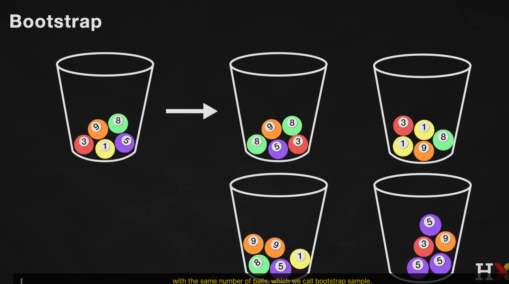

# 7. Bootstrap, Confidence Intervals, and Hypothesis Testing
In An Introduction to Statistical Learning External link 2nd Edition, read the following sections:

3.1.2 - Assessing the Accuracy of the Coefficient Estimates (pg. 63-68)
3.1.3 - Assessing the Accuracy of the Model (pg. 68-71)

[Numpy](https://numpy.org/doc/stable/user/quickstart.html)

# 7.1 Inference in Linear Regression

How confident is our inferences based in the model coeficients?

# 7.2 Bootstrap and Confidence Intervals

We evaluate the distribution of values for each coeficient

# 7.3 Evaluating Predictor Significance

# 7.4 Prediction Intervals

# Exercises

## Beta values for data from Random Universe
## Beta values for Data from Random Universe using Bootstrap
## Confidence Interval for Beta value
## Hypothesis Testing
##  Prediction Confidence Interval

# Kaggle

Inference

Bootstrap and Predictor Significance
* [Random Forest with Bootstrap Sampling for beginner](https://www.kaggle.com/code/vinayakshanawad/random-forest-with-bootstrap-sampling-for-beginner)
  * >

* [HR Analytics (DNN, LGBM + Bootstrap) Acc: 90%+](https://www.kaggle.com/code/ilyapozdnyakov/hr-analytics-dnn-lgbm-bootstrap-acc-90)
  * > 

Hypothesis Testing
* [Predicting Customer Satisfaction](https://www.kaggle.com/code/andresionek/predicting-customer-satisfaction)
  * >

 Prediction Confidence Interval
* [Forecast with N-BEATS || Interpretable model](https://www.kaggle.com/code/gatandubuc/forecast-with-n-beats-interpretable-model)
  * > 