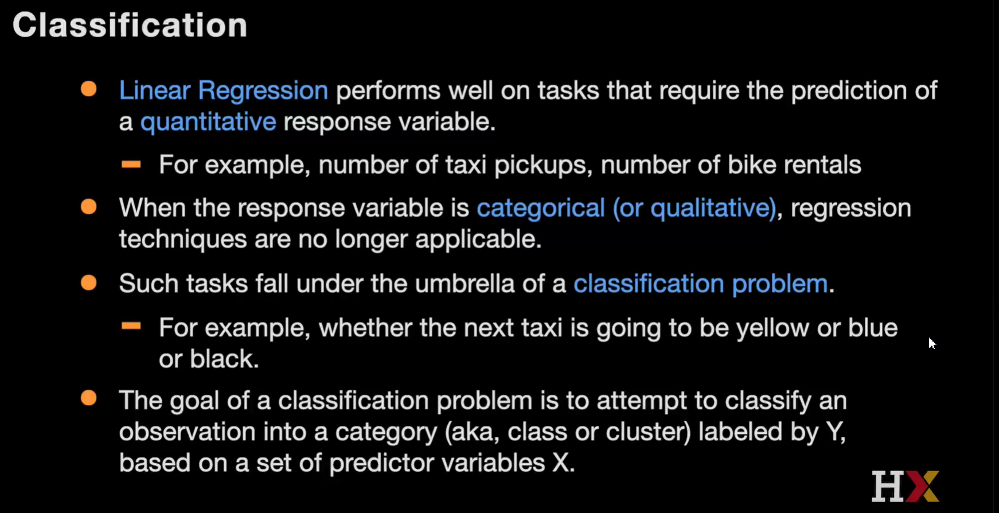

# Classification and Logistic Regression
In An Introduction to Statistical Learning External link 2nd Edition, read the following sections:

Sections 4.3 - 4.3.3 Logistic Regression (pages 133-137)

# 5.1 Classification and KNN

The probability is given by the distribution of the classes in the k nearest neighboors

# 5.2 Logistic Regression

How to interpret ROC curve?

Polinomial Logistic Regression

# Exercises
## Simple k-NN Classification and Logistic Regression
## Guesstimating Beta values for Logistic Regression

# Kaggle

kNN for classification

* [KNN for Classification using Scikit-learn](https://www.kaggle.com/code/amolbhivarkar/knn-for-classification-using-scikit-learn)
  * >

* [Step by Step Diabetes Classification-KNN-detailed](https://www.kaggle.com/code/shrutimechlearn/step-by-step-diabetes-classification-knn-detailed)
  * > 

* [Predict the Crime Category - KNN & logistic](https://www.kaggle.com/code/nitinvijay23/predict-the-crime-category-knn-logistic)
  * > 

* [Drug Classification (EDA | KNN + NB + Logistic)](https://www.kaggle.com/code/arezalo/drug-classification-eda-knn-nb-logistic#5.5.-LogisticRegression(-))
  * > 

Logistic Regression
* [Logistic Regression Classifier Tutorial](https://www.kaggle.com/code/prashant111/logistic-regression-classifier-tutorial#12.-Model-training-)
  * > 

* [Titanic: logistic regression with python](https://www.kaggle.com/code/mnassrib/titanic-logistic-regression-with-python#4.-Logistic-Regression-and-Results)
  * > 