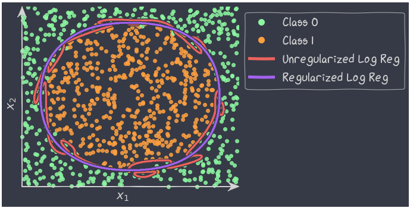

# 6. Multi-logstic Regression and missingness
In An Introduction to Statistical Learning External link 2nd Edition, read the following sections:

4.3.5 Multinomial Logistic Regression - Pages 140 to 141

# 6.1 multinomial log reg

One vs Rest aproach

True multi log reg

# 6.2 Missingness

Missing Completely at Random (MCAR)
Missing at Random (MAR)
Missing Not at Random (MNAR)

# Exercises
## Multinomial Logistic Regression
## Comparing predictors
## Imputation

# Kaggle

Multinomial Logistic Regression

* [Multinomial Logistic Regression for beginners](https://www.kaggle.com/code/saurabhbagchi/multinomial-logistic-regression-for-beginners)
  * >

* [Multinomial Logistic Regression from Scratch](https://www.kaggle.com/code/vitorgamalemos/multinomial-logistic-regression-from-scratch)
  * >

Regularization

* [Regularization (Ridge - LASSO - ElasticNet)](https://www.kaggle.com/code/aminizahra/regularization-ridge-lasso-elasticnet)
  * > 

Missingness
* [A Guide to Handling Missing values in Python](https://www.kaggle.com/code/parulpandey/a-guide-to-handling-missing-values-in-python)
  * > 